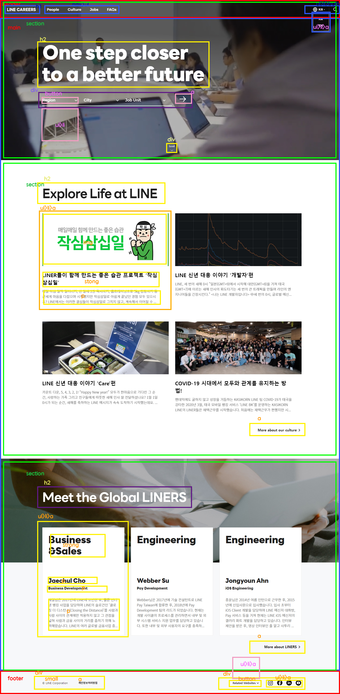

# Clone : LineCareers
## 설명
* 개발기간 : 12.02~12.16
* 클론 사이트 : [라인커리어](https://careers.linecorp.com/ko/)
* [결과](https://jinyun3075.github.io/LikeCareers/)
## 배운점
* 둘이서 페어프로그래밍으로 15분씩 돌아가면서 라이브코딩을했다. 다른 한명은 모니터링하면서 놓친부분을 잡아주고 피드백해주었기 때문에 진행도 매끄러웠고 둘이서 규칙을 정하면서 개발관련하여 소통하는것도 경험할 수 있었다.
## 힘들었던 점
* 이벤트 구현하기위해 불필요한 클래스 접근이 많았고 코드가 전체적으로 지저분함 (모듈화 연습)
* class, id, 변수 네이밍 센스 부족. (조금 시간을 투자해 고민)
## 구조

